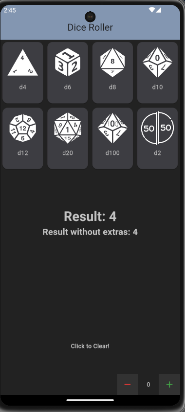

# Flutter Dice Roller
A Dice roller app made using Flutter and the [Dart Math](https://api.flutter.dev/flutter/dart-math/dart-math-library.html) library.
The icons used in this project are from https://game-icons.net/tags/dice.html which are licensed under a Free License [CC BY 3.0](https://creativecommons.org/licenses/by/3.0/)

## Flutter Project Setup

Follow these steps to set up the Flutter project using the code from this GitHub repository.

## 1. Create a new Flutter project

Open a terminal and run the following commands:

```bash
flutter create your_project_name
cd your_project_name
```

## 2. Copy the `assets` folder
Copy the `assets` folder and all its contents to the root ot the project

## 3. Replace the contents of the `lib` folder
Replace the contents of the `lib` folder with the contents of the `lib` folder in this github repo

## 4. Replace the `pubspec.yaml` file
Delete the current `pubspec.yaml` file and copy the one from this repo to the root of your project

## 5. Install dependencies

```bash
flutter pub get
```

## 6. Run the app

```bash
flutter run
```

## The end result:

